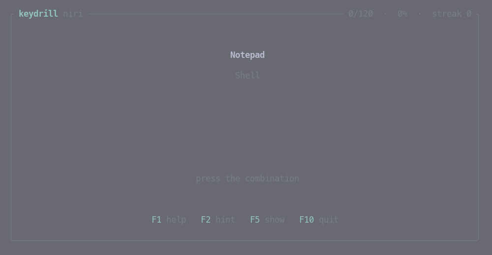
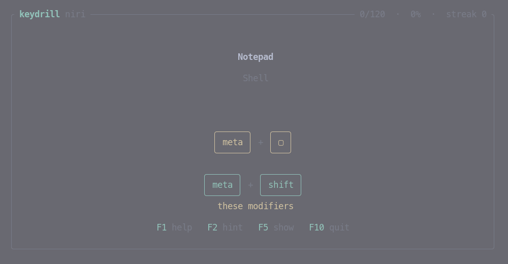
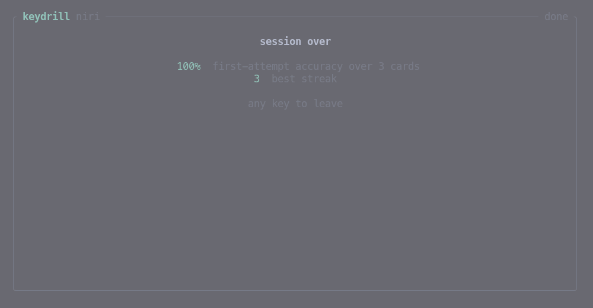

<div align="center">

# keydrill

**A terminal trainer for keyboard shortcuts. You answer by pressing them.**



</div>

## Why

Flashcards teach you that `meta+alt+3` sends a column to workspace three.
They do not teach your left thumb where Super is. The difference matters,
because the thing you want back is a reflex, not a fact.

So keydrill asks the question and waits for the keys. Get it wrong and it
does not hand the answer over — it tells you the combination has three keys,
and lets you try again. Cards you keep missing come back sooner; cards you
have owned for weeks stay out of the way.

The tools that already do this — KeyCombiner, ShortcutFoo — are closed and
hosted. keydrill is neither, and it reads the config file you actually run,
so the deck cannot drift away from your real keybinds.

## What it needs

**A terminal that speaks the [Kitty keyboard
protocol](https://sw.kovidgoyal.net/kitty/keyboard-protocol/).** This is not
a preference. An ordinary terminal cannot report Super at all — the key
simply never arrives — and a shortcut trainer that cannot see Super is a
crossword. [ghostty](https://ghostty.org), [kitty](https://sw.kovidgoyal.net/kitty/),
[foot](https://codeberg.org/dnkl/foot) and [WezTerm](https://wezterm.org)
all support it. keydrill checks at startup and tells you rather than
silently mis-grading you.

**Your compositor's own binds, switched off.** If niri or Hyprland binds
`Mod+H`, it takes the key before the terminal ever sees it — you would drill
your window manager instead of your memory. Switch the binds off for the
duration:

- **niri** — `niri msg action load-config-file --path <a config with an empty binds block>`,
  and back again afterwards. On NixOS, [sitolamix](https://github.com/sitolam/sitolamix)
  wraps exactly that as *practice mode*, bound to `Mod+Shift+Escape`.
- **Hyprland** — `hyprctl keyword submap drill` with an empty submap, then
  `hyprctl keyword submap reset`.

`keydrill doctor` reports what your terminal can do, names the compositor
holding the keyboard, and then echoes every key as it arrives — which is how
you tell the two failures apart. A combination that prints nothing at all —
modifiers appear, the key never does — is one your compositor claimed before
the terminal saw it. Run the doctor itself with the binds off
(`practice-mode run keydrill doctor`) or it will report that about its own
test.

If one specific three-key combination never arrives while its neighbours do,
suspect the keyboard rather than the software: laptop matrices routinely
refuse to report certain three-key combinations at once. Press the two halves
separately — if both arrive and the whole does not, nothing in software can
recover it.

## Install

**Nix, without installing anything:**

```sh
nix run github:sitolam/keydrill -- run --from niri
```

**As a flake input:**

```nix
{
  inputs.keydrill.url = "github:sitolam/keydrill";

  # then, in a module:
  environment.systemPackages = [ inputs.keydrill.packages.${pkgs.system}.default ];
  # or take the overlay and use pkgs.keydrill
}
```

**Cargo:**

```sh
cargo install --git https://github.com/sitolam/keydrill
```

## Use

```sh
keydrill run --from niri          # drill your live niri binds
keydrill run --from hyprland      # or your live hyprland.conf
keydrill run decks/vim-motions.toml
keydrill run --from niri -c Workspaces -n 15   # one category, fifteen cards
keydrill stats --from niri        # what is learned, due, and most forgotten
keydrill import niri -o niri.toml # freeze a deck to a file and edit it
keydrill doctor                   # capabilities, then echo what you press
```

A session ends when the queue empties, or whenever you press `F10` — progress
is saved either way. The controls are function keys on purpose: `Esc`, `q`
and `Ctrl+C` are all plausible cards, and a trainer that quits when you
answer correctly would be a poor one.

## Hints

Being shown the answer teaches you almost nothing, so keydrill gives it up a
piece at a time. `F2` climbs one rung; a wrong answer climbs one too.

```text
╭───╮   ╭───╮        ╭──────╮   ╭───╮        ╭──────╮   ╭─────╮   ╭───╮
│ ▢ │ + │ ▢ │        │ meta │ + │ ▢ │        │ meta │ + │ alt │ + │ 3 │
╰───╯   ╰───╯        ╰──────╯   ╰───╯        ╰──────╯   ╰─────╯   ╰───╯
   how many              which modifiers               all of it
```

The key itself is the last thing given up, because knowing it is a `meta+alt`
bind is usually enough to bring the rest back. If you already had the
modifiers right — a near miss, or you are holding them now — the ladder skips
the first rung, since how many keys it has is not what you were missing.

The hint appears *above* your own caps, which never move: your keys are drawn
the same way and in the same place whether a hint is up or not, so you can
watch your hands while you work the rest out.

<div align="center">



</div>

Above: the hint says the bind starts with `meta` and has one more key. Below
it, in green, the keys actually down right now.

`F5` skips the ladder and shows the whole combination — but **it does not skip
the card**. The prompt stays up and you still have to press the keys before
anything moves on. Reading a shortcut is not the same as having typed it, and
a skip that let you walk away would be a way of never learning the thing you
found hard.

Either way the card is marked as one you did not know: it counts against
first-attempt accuracy, lands in the weak spots, and comes back once more
before the session ends.

## Decks

A deck is TOML, meant to be as easy to write by hand as it is to generate:

```toml
name = "niri"
description = "Imported from niri's config.kdl"

[[card]]
description = "Focus column left"
keys = ["meta+h", "meta+left"]      # either one is correct
category = "Navigation"
```

`keys` lists every combination that counts as right — two keys that genuinely
do the same thing, not two things to memorise. Modifiers are `meta` (the
Super/Windows key), `ctrl`, `shift`, `alt`, in any order; `super`, `win`,
`cmd` and `mod` are accepted as aliases for `meta`. Keys are lowercase:
`h`, `left`, `pageup`, `f2`, `/`, `-`. The `+` key itself is written `ctrl++`.

`name` and each `description` are the deck's and the card's identity in the
state file, so renaming either starts that progress over.

## Importers

| Source | Reads | Notes |
| --- | --- | --- |
| `niri` | `~/.config/niri/config.kdl` | actions become prompts; wheel binds, `XF86` keys and `Print` are skipped |
| `hyprland` | `~/.config/hypr/hyprland.conf` | resolves `$mainMod`-style variables; `bindm` (mouse) and `print` are skipped |

An action the importer has no phrasing for keeps its raw text as the prompt,
so a gap shows up in your deck rather than going missing from it. Binds
sharing one description are merged onto a single card — arrows and `hjkl`
become one card with two accepted answers, which is how you actually think
about them.

## How scheduling works

SM-2, the algorithm behind SuperMemo and Anki's classic mode, with one
simplification: an answer is right or wrong, because a shortcut has no
"hard but correct".

- A miss puts the card back in the same session, four cards later, and drops
  its ease.
- First correct answer: due tomorrow. Second: in three days. After that the
  interval multiplies by the card's ease, capped at a year.
- Only your **first** attempt at a card counts. Getting it right after a hint
  is not knowing it, and the score says so.
- Forgetting a card you had learned is a *lapse*; `keydrill stats` ranks your
  weak spots by it. Missing a brand-new card is not a lapse — you cannot
  forget what you never knew.

State lives in `$XDG_DATA_HOME/keydrill/state.json`. It is small, readable,
and safe to delete; that is the whole recovery story.

<div align="center">



</div>

## Design notes

**Every colour is one of the terminal's own sixteen.** No palette, no theme
file, no configuration: keydrill wears whatever your terminal wears, and a
system-wide theme applies to it for free.

**The key-cap row is live.** Because the Kitty protocol reports key releases,
the caps light up as you hold modifiers and go out as you let go — which is
what makes it feel like practice rather than a quiz.

**Modules stay small and testable.** Combination parsing, scheduling, session
ordering and the importers each have their own tests and know nothing about
the terminal. `cargo test` runs the lot in well under a second.

## Licence

GPL-3.0-or-later. See [LICENSE](LICENSE).
